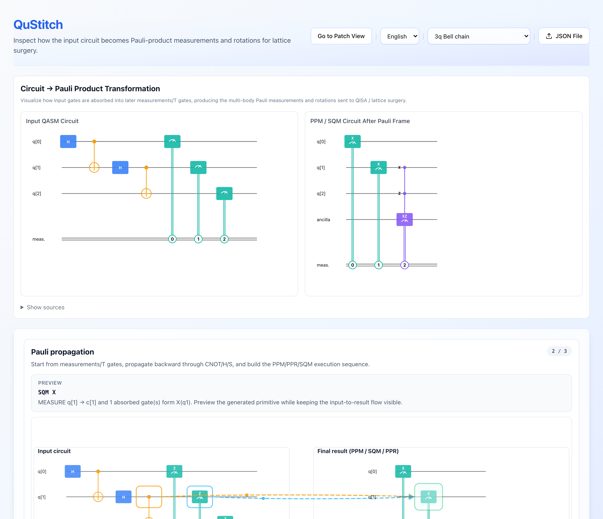
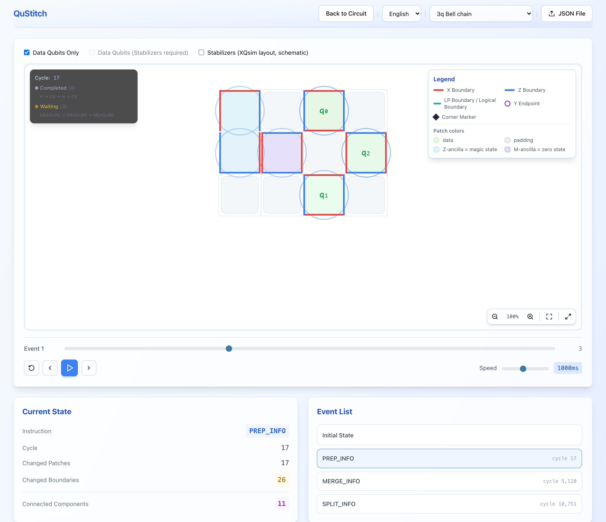

# QuStitch

QuStitch is an interactive visualizer for **surface-code lattice surgery**. It
shows how a quantum circuit is compiled into Pauli-product measurements and
rotations, and how those operations are executed as merge / split operations on
a grid of logical patches, cycle by cycle.

The execution data comes from [XQsim](https://github.com/SNU-HPCS/XQsim), a
cycle-level simulator of a fault-tolerant quantum control processor. QuStitch
adds a trace-generation backend on top of XQsim and a web frontend that plays
the traces back. Sixteen example traces are bundled, so the frontend works
without running the simulator.

| Circuit view | Patch view |
| --- | --- |
|  |  |

## Features

- **Circuit → Pauli product**: side-by-side view of the input OpenQASM circuit
  and the PPM / PPR / SQM circuit obtained after Pauli-frame absorption, plus a
  step-by-step animation of the Pauli propagation through CNOT / H / S gates.
- **Execution schedule**: one card per input gate showing how it is executed
  (Pauli-product measurement, π/8 rotation, single-qubit measurement or Pauli
  frame), the QISA instruction window, and sampled measurement outcomes.
- **Patch view**: the logical patch grid animated over the lattice-surgery
  events reported by XQsim, with X / Z / Y / logical boundaries, merged
  regions, patch roles (data, magic-state ancilla, zero-state ancilla, padding),
  a schematic stabilizer layout, and a trace inspector for raw event data.
- **Playback**: timeline slider, step / play controls, adjustable speed,
  pan / zoom and fullscreen; English and Japanese UI.

## Repository layout

```text
QuStitch/
├── frontend/          React + TypeScript + Vite web application
│   ├── public/        Bundled example traces (circuit_*.json)
│   └── src/           app/ (views), components/, hooks/, lib/ (pure logic), i18n/, types/
├── backend/           Trace generator built on XQsim
│   ├── qustitch_trace/  Python package: CLI, HTTP API, trace assembly
│   ├── tools/           Sample regeneration, validation, batch requests
│   ├── tests/           pytest suite (no simulator required)
│   └── xqsim/           Vendored XQsim simulator and compiler (see UPSTREAM.md)
└── docs/              Trace format reference and screenshots
```

## Quick start (frontend only)

Requirements: Node.js 20 or later.

```bash
cd frontend
npm install
npm run dev
```

Open <http://127.0.0.1:3000>, pick a sample from the header, and use **Go to
Patch View** to follow the lattice-surgery operations. You can also upload any
trace JSON produced by the backend.

Other scripts: `npm run build` (production build to `dist/`), `npm test`,
`npm run lint`, `npm run typecheck`, `npm run format`.

## Generating traces (backend)

The backend turns an OpenQASM 2.0 circuit into a trace JSON by compiling it with
XQsim's compiler and observing the simulated control processor cycle by cycle.
A 2-qubit circuit takes roughly 10 minutes on a laptop; 6 qubits take about an
hour. See [backend/README.md](backend/README.md) for details.

With Docker:

```bash
cd backend
docker compose up --build
curl -X POST http://localhost:8000/trace \
  -H "Content-Type: application/json" \
  -d '{"qasm": "OPENQASM 2.0;\ninclude \"qelib1.inc\";\nqreg q[2];\ncreg c[2];\nh q[0];\ncx q[0],q[1];\nmeasure q[0] -> c[0];\nmeasure q[1] -> c[1];"}' \
  > trace.json
```

With a local Python 3.10 environment:

```bash
cd backend
python -m pip install -r requirements.txt
python -m qustitch_trace --qasm-file circuit.qasm --out trace.json
```

Regenerate all bundled samples with `python tools/regenerate_samples.py` and
validate any trace with `python tools/validate_trace.py trace.json`.

## Trace format

Traces are JSON documents (schema `1.1.0`) with the patch layout, the list of
patch events, the QISA instruction trace, derived surgery seams, the logical
qubit mapping, and a per-gate execution trace. The format is documented in
[docs/TRACE_FORMAT.md](docs/TRACE_FORMAT.md).

## How it works

1. **Compilation**: XQsim's `gsc_compiler` decomposes the circuit into
   Clifford+T gates, propagates every measurement and T gate backwards through
   the preceding Cliffords to obtain Pauli-product measurements (PPM) and π/8
   rotations (PPR), and emits a QISA program. QuStitch records this
   propagation as `pauli_product_blocks`.
2. **Simulation**: the QISA program runs on XQsim's control-processor model in
   emulate mode (no physical-qubit simulation). QuStitch snapshots the patch
   information unit after every cycle and records each accepted `PREP_INFO`,
   `MERGE_INFO` and `SPLIT_INFO` instruction as a patch event with the changed
   boundaries.
3. **Derivation**: from the patch states and instruction operands the backend
   derives surgery seams, links PPM / PPR blocks to their merge / split windows,
   and, for circuits with T gates, samples logical measurement outcomes from an
   ideal logical-state oracle.
4. **Visualization**: the frontend replays the events and renders the patch
   grid with the Canvas API; all derivations used by the UI live in
   `frontend/src/lib` and are unit-tested against the bundled traces.

## Citing

If you use QuStitch in your research, please cite our QCE 2026 paper:

```bibtex
@inproceedings{tsuboi2026qustitch,
  title     = {QuStitch: An Interactive Multi-Level Visualization for Lattice Surgery Quantum Computation},
  author    = {Seita Tsuboi and Leo Itoh and Takuya Kasamura and Junichiro Kadomoto},
  booktitle = {IEEE International Conference on Quantum Computing and Engineering (QCE)},
  month     = {9},
  year      = {2026}
}
```

QuStitch builds on XQsim; please also cite:

> I. Byun, J. Kim, D. Min, I. Nagaoka, K. Fukumitsu, I. Ishikawa, T. Tanimoto,
> M. Tanaka, K. Inoue, J. Kim, "XQsim: Modeling Cross-Technology Control
> Processors for 10+K Qubit Quantum Computers," ISCA 2022.

The lattice-surgery compilation follows D. Litinski, "A Game of Surface Codes:
Large-Scale Quantum Computing with Lattice Surgery," Quantum 3, 128 (2019).

## License

QuStitch is released under the [MIT License](LICENSE). The vendored XQsim code
in `backend/xqsim/` is © 2023 SNU-HPCS, MIT License; see
[THIRD_PARTY_NOTICES.md](THIRD_PARTY_NOTICES.md) and
[backend/UPSTREAM.md](backend/UPSTREAM.md) for the list of modifications.
